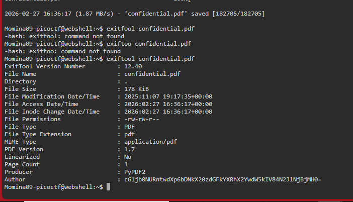

# CTF Challenge: Riddle Registry  

---

## 📝 Description  
Hi, intrepid investigator! 📄🔍 You've stumbled upon a peculiar PDF filled with what seems like nothing more than garbled nonsense. But beware! Not everything is as it appears. Amidst the chaos lies a hidden treasure—an elusive flag waiting to be uncovered.
Find the PDF file here Hidden Confidential Document and uncover the flag within the metadata.

---

### Solution

---

### Step 1: Download the file  
Download the pdf file and uncover the flag within the metadata.

By downloading the file, we see 1 page dicument having content that might look important but is no becuase there are some black lines to cover some words.

 checked those by copying and pasting them to other medium sach as Notepad but it was nothing 

we will check the metadata of this PDF file by exitfool command.

Download the PDF file in Linux by wget https://challenge-files.picoctf.net/c_amiable_citadel/3f00b89eeac6ac5242f747889ea4de24c804d9144cfa71e23d754e6a8e80e435/confidential.pdf

check the metadata of this PDF file by: exitfool confidential.pdf

This gives us the encoded text at the Author tag
cGljb0NURntwdXp6bDNkX20zdGFkYXRhX2YwdW5kIV9jOTk5ZTJhNH0= and the = indicates that it is base64 encoded text.

Decoding this text at CyberChef website by choosing From base64 then we get the flag

